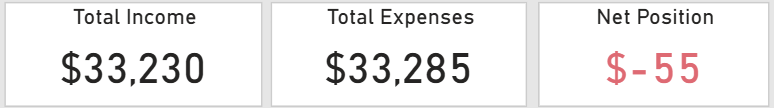
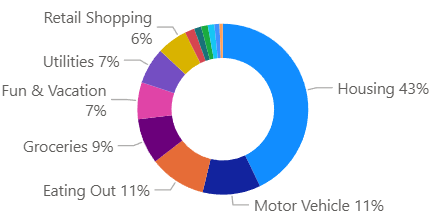
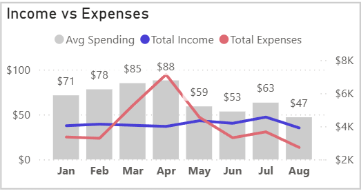
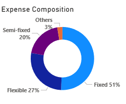
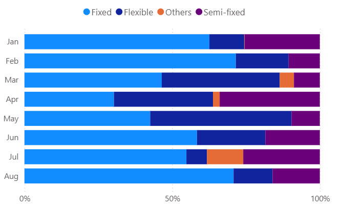
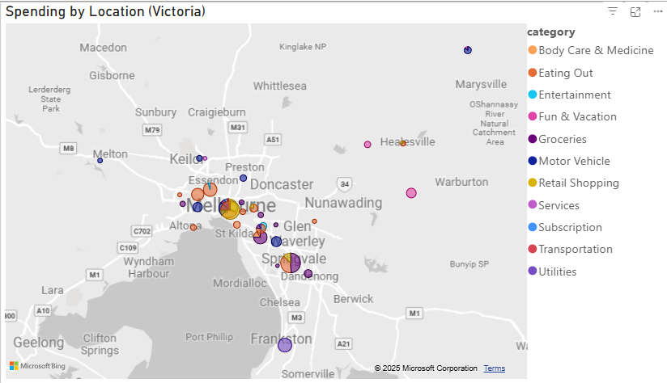

## About the Project
This project applies data analytics techniques to my own bank transactions for the period from January to August 2025.

The goal is to analyze spending behavior, identify patterns and anchors, and present findings in a clear, professional dashboard/report format.

It demonstrates how personal finance data can be transformed into insights — useful both for self-management and as a showcase of my data storytelling skills in a portfolio.

## Snapshot

  
   
  <em>Fig. 1: KPIs</em>

  
   
  <em>Fig. 2: Spending by Categories</em>

👉 Housing was the biggest anchor every month. Motor Vehicle spending wasn’t about regular fuel use — it spiked from insurance (March) and plate renewal (July). Eating Out reflected day-to-day convenience and occasional social dining.

## Trends & Shifts

  
   
  <em>Fig. 3: Monthly Trend</em>

- Income steady at ~$3,800/month.
- Expense spikes: March (+25%) from family trip flight + annual car insurance, and April (+45%) hosting family from Vietnam.
- Average spend per purchase dropped from $71 → $47, meaning more small, everyday transactions replaced fewer large ones.
- Net position peaked at +$852 in Feb before dipping to –$55 in Aug.

👉 Temporary family-related events explain the overspending spikes. Outside of these, spending followed smaller but more frequent habits (groceries, convenience food, subscriptions).

## Spending Structure

  <table>
    <tr>
      <td align="center">
         
        <em>Fig. 4.1: Anchor-Costs Distribution</em>
      </td>
      <td align="center">
         
        <em>Fig. 4.2: Monthly Trend</em>
      </td>
    </tr>
  </table>

- Fixed cost: housing, utilities, subscriptions
- Semi-fixed cost: motor vehicle, groceries
- Flexible: eating out, entertainment, retail, vacations
- Other: new or irregular categories

👉 Over half my budget is locked into fixed commitments. Semi-fixed costs (car + groceries) shift up or down slightly each month. Flexible spend is the main lever I can adjust — this is where lifestyle and choice-driven spending sit.

## Where I Spend It

  
   
  <em>Fig. 5: Spending in Victoria</em>

- CBD: 19% of Eating Out (restaurants, weekends) + 57% of Retail (clothes, electronics).
- Suburb (Caulfield + Malvern East): 16% of Eating Out, mostly fast food + convenience tied to daily walks.
- Motor Vehicle:
    + 30% on fuel in Oakleigh (convenient refuel point between home and city).
    + Fuel in Tottenham (close to a friend’s place).
    + 15% on CBD parking (mainly weekends).

👉 Location reflects practical choices: CBD for leisure/shopping, local suburb for daily routines, Oakleigh and Tottenham for convenient refuelling near travel routes or visits.

## Key Takeaways (Jan-Aug 2025)
1. Housing dominates at 43%, anchoring spending every month.
2. Car costs were irregular but heavy (insurance + plate renewal), not everyday fuel.
3. Family visits explain the sharpest spikes in March–April.
4. Daily convenience (fast food, local shops, subscriptions) shaped much of the flexible spending.
5 With a small net deficit (–$55), reducing flexible spend by 10–15% would easily bring me back into surplus.

