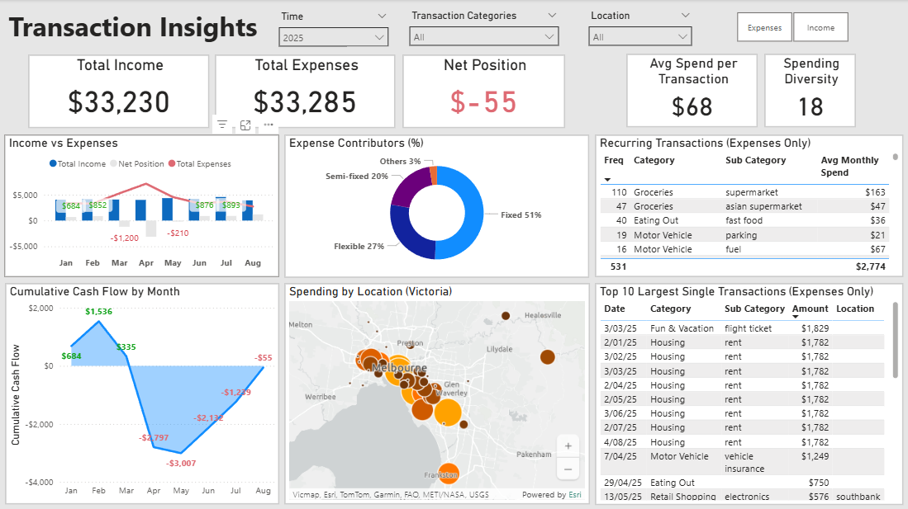

# 💰 Living Below Your Means — Cash Flow Analysis (Jan–Aug 2025)

---

## 🧭 Introduction

### **About the Project**
This project analyses my personal bank transactions from **January to August 2025** to evaluate whether I am *living below my means* — that is, whether my monthly spending consistently stays within my income.

### **The Question**
> “If I earn around **$4,000 per month**, do I live below my means — or do my expenses exceed what I make?”

This report answers that question by examining **monthly cash flow** — how much money came in, how much went out, and whether each month ended in surplus or deficit.

Rather than targeting savings or investment goals, the focus is on **cash-behaviour realism** — how money actually moves through daily life, influenced by events, convenience, and fixed commitments.

### **Project Challenge**
Personal-finance data is often **unstructured, inconsistent, and event-driven**, making meaningful analysis difficult.  
My biggest challenge was to **standardise multiple bank exports** (ANZ, Westpac, etc.) into one consistent dataset and correctly classify transactions that mix essentials (rent, utilities) with one-off events (travel, car insurance).

  <table>
    <tr>
      <td align="center">
         
        <em>Westpac raw dataset</em>
      </td>
      <td align="center">
         
        <em>ANZ raw dataset</em>
      </td>
    </tr>
  </table>

Instead of chasing daily precision, I designed a system optimised for **monthly accuracy** — accurate enough to capture spending trends while accepting minor posting delays.

---

## ⚙️ Project Building Summary (SQL)
- Merged multiple bank formats (ANZ, Westpac) into one unified dataset.  
- Cleaned and normalised transaction descriptions, removing card numbers and repeated prefixes.  
- Automatically classified categories using pattern matching (e.g., `"APPLE.COM"` → *Entertainment*).  
- Extracted locations by matching text tokens against a **Melbourne-suburb dictionary** for spatial insight.

  

  
   
  <em>Cleaned Dataset (combined)</em>

---

## 📊 Results
You can download the Power BI dashboard [here*](https://github.com/khoitran2603/Personal-DA-PBI-Transactions/blob/main/Spending%20Dashboard.pbix)

  

  
   
  <em>Monthly Transactions Dashboard</em>

### **Income vs Expense Overview**
(Linked to Visual 1: Monthly Income vs Expense Trend)

- Over eight months, my **total spending ($33,285)** nearly equalled my **total income ($33,230)** — a minimal deficit of **– $55** overall.  
- Most months’ expenses stayed below income, with clear overspending during **March–April** (≈ 25–45 % above average) due to **family travel and hosting visitors from overseas**.

🟢 **Interpretation:** This indicates tight balance control — I live within my means during typical months, with short-term overspending tied to special events.

---
  
## Cash Flow Over Time
(Linked to Visual 2: Cumulative Net Cash Flow)

- The chart tracks how my cash position evolved across the eight months.  
- The cumulative balance climbed early in the year, **peaking in February (+ $1,536)**, then dropped to **– $3,000 in May** before recovering steadily toward balance.

> 💬 *This pattern shows strong control — short-term overspending doesn’t create long-term imbalance.*

Despite temporary fluctuations, the cumulative line ends close to zero, confirming I operated **at or slightly below my means**, without a sustained deficit.

---

### **Spending Structure & Flexibility**
(Linked to Visual 3: Expense Composition — Doughnut Chart)

To evaluate whether I’m living below my means, I grouped my spending into four structural types:

|**Type**|**Flexibility**|**Description**|
| :- | :- | :- |
|Fixed|None|Rent, utilities, subscriptions - unavoidable costs.|
|Semi-fixed|Low|Vehicle, groceries - somewhat controllable.|
|Flexible|High|Eating out, entertainment, retail - lifestyle-driven.|
|Other|Varies|New or irregular categories.|

- More than half of my budget is locked into predictable commitments, forming a stable base.  
- 🎯 The **flexible portion (27 %)** is the deciding factor in whether I live below my means — it represents lifestyle and choice-driven spending.
- A small trim of **5–10 %** in this area would free an extra **≈ $100 per month** without affecting essential comfort.

---

### **Flexible Spending Breakdown**
(Linked to Visual 4: Category Deep-Dive — Bar Chart)

Within flexible costs:
- **Eating Out** – 39 % (≈ 106 transactions): medium-sized, frequent purchases.  
- **Fun & Vacation** – 26 %: one-time spikes (March–April).  
- **Retail Shopping** – 21 %: weekend and social spending.  

🍔 Most flexible spending ties to **convenience or social activity**, not impulsive luxury.

Visual 4 highlights how small, repeated choices — takeaway food, coffee, short outings — collectively determine whether I stay below my means.  
This turns *overspending* from a vague feeling into **precise, measurable, and adjustable behaviour**.

---

### **Location Patterns**
*(Linked to Visual 5 — Location-Aware Map)*  

My three main spending zones reflect everyday movement patterns:

| **Area** | **Behaviour Insight** |
|:--|:--|
| **Inner Melbourne (CBD + Southbank)** | Weekend spending — restaurants, parking, and retail (clothes, electronics, home items). |
| **Local Suburb (Caulfield)** | ~ 80 % groceries + 15 % fast food tied to daily walking routine. |
| **Workplace Suburb (Springvale)** | Lunch break meals and after-work groceries. |

Visual 5 shows that higher-spend areas align with **planned or convenient locations**, not random or wasteful ones.  
🗺️ Location spending validates behavioural logic — even flexible spending remains practical and context-driven.

---

## ✅ Key Takeaways
1. **Cash Flow Stability:** Average income ≈ $4k, expenses ≈ $4.01k → break-even trend.  
2. **Event-Driven Overspending:** Temporary spikes (Mar–Apr) with clear causes.  
3. **Behavioural Recovery:** Spending returns to baseline quickly after events.  
4. **Structured Budget:** 70 % fixed/semi-fixed costs = stable base.  
5. **Below-Means Verdict:** Normal months ≈ $700 surplus → living comfortably within means.

---

## 🏁 Conclusion

This project turned eight months of personal bank transactions into a clear, data-driven view of **cash flow behaviour** — revealing how income, expenses, and lifestyle choices interact over time.

By building a **SQL-based data pipeline** (Bronze → Silver → Gold) and visualising the results in **Power BI**, I transformed unstructured statements into measurable insights:

- My monthly spending generally stays **within or slightly below my income**, except for short, event-driven spikes.  
- Overspending periods were temporary, tied to **family travel and hosting**, not ongoing lifestyle drift.  
- After these spikes, spending quickly returned to baseline, confirming strong **financial self-regulation**.  

In practical terms, this means I am **living below my means** most of the time — and I can prove it with data.  
The analysis shows that by controlling flexible expenses by just **5–10 %**, I could maintain a stable surplus each month without affecting comfort or quality of life.

> 💬 *Living below your means is not about restriction — it’s about rhythm and awareness.*  
> My financial rhythm shows consistency, adaptability

---

## 🧩 Visual References

| **Visual #** | **Type / Purpose** | **Section Reference** |
|:--|:--|:--|
| ① | Monthly Income vs Expense Trend (Combo Chart) | Income vs Expense Overview |
| ② | Cumulative Net Cash Flow (Line Chart) | Cash Flow Over Time |
| ③ | Expense Composition (Doughnut Chart) | Spending Structure & Flexibility |
| ④ | Flexible Spending Breakdown (Bar Chart) | Flexible Spending Breakdown |
| ⑤ | Location-Aware Map (Filled Map) | Location Patterns |

---

## 🧾 Footer

*Data Source:* Personal bank transactions (Jan–Aug 2025)  
*Processing:* SQL Bronze → Silver → Gold Pipeline  
*Visualisation:* Power BI Desktop (5 core visuals + KPI cards)

---
