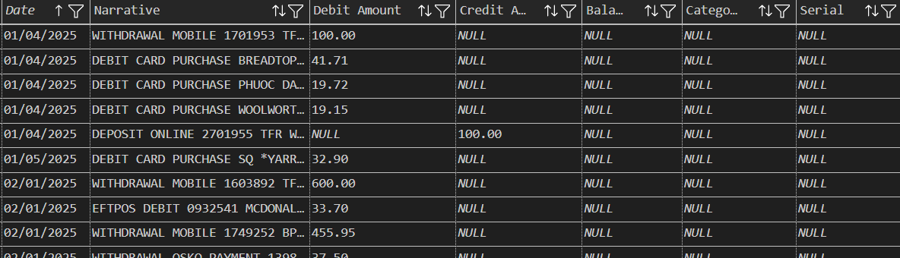
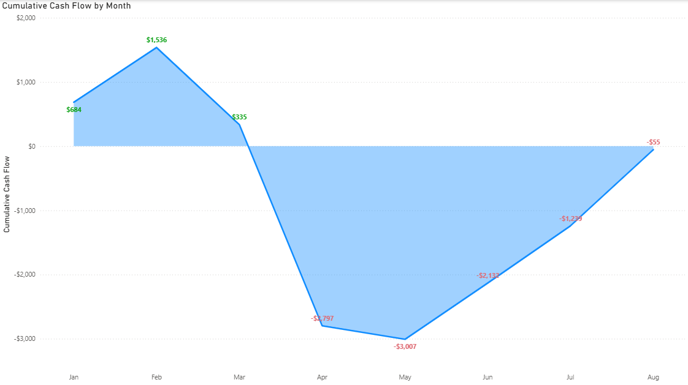

# 💰 Living Below Your Means — Cash Flow Analysis (Jan–Aug 2025)

---

## 🧭 Introduction

### **About the Project**
This project analyses my personal bank transactions from **January to August 2025** to evaluate whether I am *living below my means* — that is, whether my monthly spending consistently stays within my income.

### **The Question**
> “If I earn around **$4,000 per month**, do I live below my means — or do my expenses exceed what I make?”

This report answers that question by examining **monthly cash flow** — how much money came in, how much went out, and whether each month ended in surplus or deficit.

Rather than targeting savings or investment goals, the focus is on **cash-behaviour realism** — how money actually moves through daily life, influenced by events, convenience, and fixed commitments.

### **Project Challenge**
Personal-finance data is often **unstructured, inconsistent, and event-driven**, making meaningful analysis difficult.  
My biggest challenge was to **standardise multiple bank exports** (ANZ, Westpac, etc.) into one consistent dataset and correctly classify transactions that mix essentials (rent, utilities) with one-off events (travel, car insurance).

  <table>
    <tr>
      <td align="center">
         
        <em>Tab 1. Westpac raw dataset</em>
      </td>
      <td align="center">
         
        <em>Tab 2. ANZ raw dataset</em>
      </td>
    </tr>
  </table>

Instead of chasing daily precision, I designed a system optimised for **monthly accuracy** — accurate enough to capture spending trends while accepting minor posting delays.

---

## ⚙️ Project Building Summary (SQL)
- Merged multiple bank formats (ANZ, Westpac) into one unified dataset.  
- Cleaned and normalised transaction descriptions, removing card numbers and repeated prefixes.  
- Automatically classified categories using pattern matching (e.g., `"APPLE.COM"` → *Entertainment*).  
- Extracted locations by matching text tokens against a **Melbourne-suburb dictionary** for spatial insight.

  

  
   
  <em>Tab 3. Cleaned Dataset (combined)</em>

---

## 📊 Results
You can download the Power BI dashboard [here*](https://github.com/khoitran2603/Personal-DA-PBI-Transactions/blob/main/Spending%20Dashboard.pbix)

  

  
   
  <em>Fig 1. Monthly Transactions Dashboard</em>

### **Income vs Expense Overview**
  

  
   
  <em>Fig 2. Monthly Income vs Expense Trend</em>

- Over eight months, my **total spending ($33,285)** nearly equalled my **total income ($33,230)** — a minimal deficit of **– $55** overall.  
- Most months’ expenses stayed below income, with clear overspending during **March–April** (≈ 25–45 % above average) due to **family travel and hosting visitors from overseas**.

> 🟢 *This indicates **tight balance control** — I live within my means during typical months, with short-term overspending tied to special events.*

---
  
## Cash Flow Over Time
  

  
   
  <em>Fig 3. Cumulative Net Cash Flow</em>

- The cumulative balance climbed early in the year, **peaking in February (+ $1,536)**, then dropped to **– $3,000 in May** before recovering steadily toward balance.
- Despite temporary fluctuations, the cumulative line ends close to zero, confirming I operated **at or slightly below my means**, without a sustained deficit.

> 💬 *This pattern shows strong control — short-term overspending doesn’t create long-term imbalance.*

---

### **Spending Structure & Flexibility**
To evaluate whether I’m living below my means, I grouped my spending into four structural types:

|**Type**|**Flexibility**|**Description**|                                                          
| :- | :- | :- |
|Fixed|None|Rent, utilities, subscriptions - unavoidable costs.|
|Semi-fixed|Low|Vehicle, groceries - somewhat controllable.|
|Flexible|High|Eating out, entertainment, retail - lifestyle-driven.|
|Other|Varies|New or irregular categories.|

  

  
   
  <em>Fig 4. Expense Composition</em>

- More than half of my budget is locked into predictable commitments (**Fixed**), forming a stable base cost.
- Groceries and vehicle use relate to daily necessities and consumption, so these **Semi-Fixed** expenses fluctuate slightly but are largely unavoidable.
- The **Flexible** category is where real control lies — small, conscious adjustments of **5–10%** (i.e., eating out) could free an extra ≈ **$100** per month without affecting essential needs or overall comfort.

> *🎯 The **flexible portion** is the deciding factor in whether I live below my means — it represents lifestyle and choice-driven spending.*

---

### **Flexible Spending Breakdown**
  

  
   
  <em>Fig 5. Flexible Spending Breakdown</em>

- **Eating Out (39%, 106 transactions)**: This category made up the largest portion of flexible spending, consisting of medium-sized, frequent purchases spread throughout the period.
- **Fun & Vacation (26%, 14 transactions )**: Spending in this area was driven mainly by one-time spikes during March and April, linked to family travel and leisure activities.
- **Retail Shopping (21%, 26 transactions)**: These expenses reflected weekend and social spending, including clothes, accessories, and small leisure items.

> *🍔 Together, these flexible categories form the most adjustable part of my budget — areas I can consciously moderate to stay below my means without limiting comfort or daily convenience.*

---

### **Location Patterns**

  <table>
    <tr>
      <td align="center">
         
        <em>Fig. 6: Location-Aware Map</em>
      </td>
      <td align="center">
         
        <em>Fig. 7: Top 5 Spending by Location</em>
      </td>
    </tr>
  </table>

Inner Melbourne, my workplace, and home suburb are the three zones where I spent the most, reflecting how routine, convenience, and social activities shape my lifestyle:
- **Inner Melbourne (CBD + Southbank)**: I spent most weekends in the city, mainly on restaurant dining, parking, and retail shopping, such as clothes, electronics, and home furniture. These purchases reflect planned social activities and occasional leisure, rather than routine spending.
- **Local Suburb (Caulfield)**: Around 80% of my spending here went toward groceries for daily needs, while roughly 15% was on fast food and convenience meals tied to my walking routine and nearby shops. This reflects practical, convenience-based habits connected to day-to-day living.
- **Workplace Suburb (Springvale)**: Most transactions in this area were for lunch breaks and small after-work grocery runs, showing functional weekday spending that aligns closely with my work schedule.

> *🗺️ Location spending validates behavioural logic — even flexible spending remains practical and context-driven.*

---

## ✅ Key Takeaways
1. **Cash Flow Stability:** Average income ≈ $4k, expenses ≈ $4.01k → break-even trend.  
2. **Event-Driven Overspending:** Temporary spikes (Mar–Apr) with clear causes.  
3. **Behavioural Recovery:** Spending returns to baseline quickly after events.  
4. **Structured Budget:** 70 % fixed/semi-fixed costs = stable base.  
5. **Below-Means Verdict:** Normal months ≈ $700 surplus → living comfortably within means.

---

## 🏁 Conclusion

This project turned eight months of personal bank transactions into a clear, data-driven view of **cash flow behaviour** — revealing how income, expenses, and lifestyle choices interact over time.

By building a **SQL-based data pipeline** (Bronze → Silver → Gold) and visualising the results in **Power BI**, I transformed unstructured statements into measurable insights:

- My monthly spending generally stays **within or slightly below my income**, except for short, event-driven spikes.  
- Overspending periods were temporary, tied to **family travel and hosting**, not ongoing lifestyle drift.  
- After these spikes, spending quickly returned to baseline, confirming strong **financial self-regulation**.  

In practical terms, this means I am **living below my means** most of the time — and I can prove it with data.  
The analysis shows that by controlling flexible expenses by just **5–10%**, I could maintain a stable surplus each month without affecting comfort or quality of life.

---
