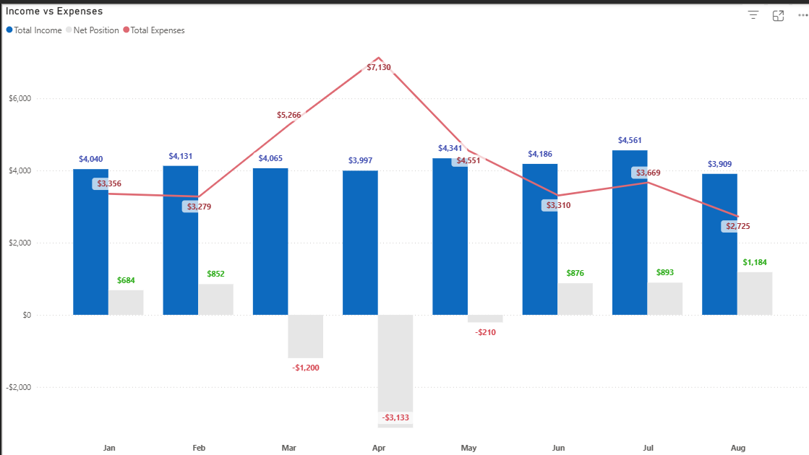

## About the Project
This project applies data analytics techniques to my own bank transactions for the period from January to August 2025.

The goal is to analyze spending behavior, identify patterns and anchors, and present findings in a clear, professional dashboard/report format.

It demonstrates how personal finance data can be transformed into insights — useful both for self-management and as a showcase of my data storytelling skills in a portfolio.

## Snapshot

  
   
  <em>Fig. 1: KPIs</em>

  
   
  <em>Fig. 2: Spending by Categories</em>

Housing was the biggest anchor every month. Motor Vehicle spending wasn’t about regular fuel use — it spiked from insurance (March) and plate renewal (July). Eating Out reflected day-to-day convenience and occasional social dining.

## Trends & Shifts

  
   
  <em>Fig. 3: Monthly Trend</em>

- Income steady at ~$3,800/month.
- Expense spikes: March (+25%) from family trip flight + annual car insurance, and April (+45%) hosting family from Vietnam.
- Average spend per purchase dropped from $71 → $47, meaning more small, everyday transactions replaced fewer large ones.
- Net position peaked at +$852 in Feb before dipping to –$55 in Aug.

Temporary family-related events explain the overspending spikes. Outside of these, spending followed smaller but more frequent habits (groceries, convenience food, subscriptions).

## Spending Structure
- Fixed: 51% (housing, utilities, subscriptions)
- Semi-fixed: 20% (car + groceries)
- Flexible: 27% (eating out, entertainment, shopping, vacations)
- Other: 3% (new categories)

👉 Insight: Over half of my budget is locked, but flexible areas still leave room for control.

## Where I Spend It
- CBD: 13% of Eating Out (restaurants, weekends) and 48% of Retail Shopping (clothes, electronics).
- Suburb (Caulfield + Malvern East): 11% of Eating Out (fast food + convenience during daily walks).
- Motor Vehicle: 10% on fuel (Oakleigh/Tottenham), 6% on CBD parking.

👉 Insight: Location reflects lifestyle: CBD = leisure/social, Suburb = routine, Oakleigh/Tottenham = travel/social.

## Key Takeaways (Jan-Aug 2025)
1. Housing is the dominant anchor (43%).
2. Family visits explain the sharpest expense spikes.
3. Routines (daily walks, car use) strongly shape spending distribution.
4. A minor deficit (–$55) highlights stability, but a limited buffer — reducing 10–15% flexible spend would restore surplus.

